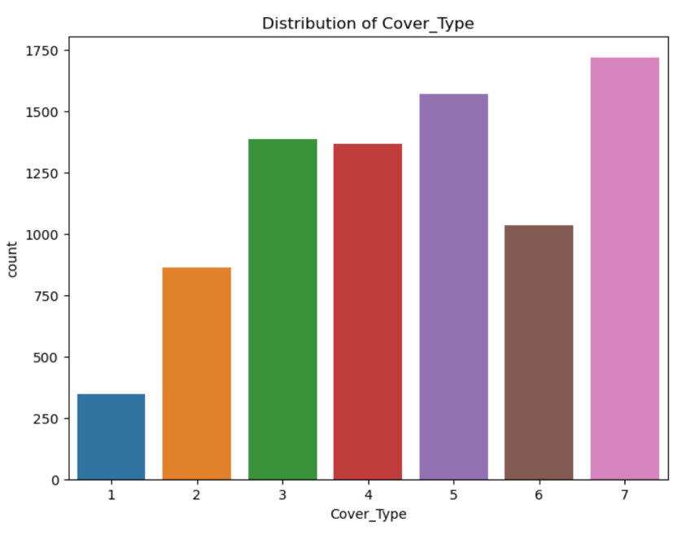

# Forest Cover Type Prediction

## Problem Overview

The problem associated with this dataset is to predict the forest cover type based on the given features. It is a multi-class classification problem where the goal is to classify each instance into one of the seven forest cover types.

<table>
<tr>
<td>

</td>
</tr>
</table>


## Dataset Overview

The dataset used for the Forest Cover Type Prediction study is sourced from the Roosevelt National Forest in northern Colorado. The data encapsulates features from the wilderness areas within this forest, with each observation representing a 30m x 30m patch of land. The primary goal is to predict the forest cover type, which is an integer classification representing one of seven possible forest cover types.

Target Variable: Forest Cover Types:
```
1 - Spruce/Fir
2 - Lodgepole Pine
3 - Ponderosa Pine
4 - Cottonwood/Willow
5 - Aspen
6 - Douglas-fir
7 – Krummholz
```
Features:
```
• Elevation : Elevation in meters
• Aspect : Aspect in degrees azimuth
• Slope : Slope in degrees
• Horizontal_Distance_To_Hydrology : Horz Dist to nearest surface water features
• Vertical_Distance_To_Hydrology : Vert Dist to nearest surface water features
• Horizontal_Distance_To_Roadways : Horz Dist to nearest roadway
• Hillshade_9am (0 to 255 index) : Hillshade index at 9am, summer solstice
• Hillshade_Noon (0 to 255 index) : Hillshade index at noon, summer solstice
• Hillshade_3pm (0 to 255 index) : Hillshade index at 3pm, summer solstice
• Horizontal_Distance_To_Fire_Points : Horz Dist to nearest wildfire ignition points
• Wilderness_Area (4 binary columns, 0 = absence or 1 = presence) : Wilderness area designation
• Soil_Type (40 binary columns, 0 = absence or 1 = presence) : Soil Type designation
• Cover_Type (7 types, integers 1 to 7) : Forest Cover Type designation
```

## Project Flowchart

The methodology of the Forest Cover Type Prediction project encapsulates a series of steps executed using machine learning techniques. Initially, the project establishes baseline performance by exploring diverse ML models. It then seeks to enhance accuracy through meticulous feature selection and dimensionality reduction techniques. Progressing further, the project incorporates advanced ensemble strategies and integrates PKI to refine the forest cover type predictions, leading to a robust set of models. Finally, the models are evaluated and the best-performing one is selected based on its accuracy and predictive capabilities.

<table>
<tr>
<td>

</td>
</tr>
</table>

# Exploratory Data Analysis (EDA)

The EDA section visually explores the dataset to understand the distribution, correlations, and characteristics of the features. Below are visualizations that depict these aspects:

### Distribution and Correlation

<table>
<tr>
  <th>Distribution of Cover Type</th>
  <th>Correlation Heatmap</th>
</tr>
<tr>
  <td></td>
  <td></td>
</tr>
</table>

### Categorical and Numerical Feature Analysis

<table>
<tr>
  <th>Categorical Feature Analysis</th>
  <th>Numerical Feature Analysis</th>
</tr>
<tr>
  <td></td>
  <td></td>
</tr>
</table>

### Skewness Analysis

<table>
<tr>
  <th>Skewness of Numerical Features</th>
  <th>Histograms for Skewness Analysis</th>
</tr>
<tr>
  <td></td>
  <td></td>
</tr>
</table>

# Obtain Baseline Performance

To establish baseline performance, several machine learning methods were applied to the dataset. The accuracy for each model was calculated, and the best two models were identified as Decision Tree and KNN based on their performance.

### Baseline Performance Evaluation

The analysis commenced with the evaluation of multiple machine learning classifiers to determine a baseline performance. The accuracy of each model was measured after applying the following classifiers to the dataset:

- K-Nearest Neighbors (KNN)
- Logistic Regression
- Support Vector Machine (SVM)
- Decision Tree
- Naive Bayes

Each classifier's performance was quantified and illustrated through a bar chart. Based on the obtained results, the Decision Tree and KNN models emerged as the top performers in terms of baseline accuracy.

<table>
<tr>
<td>

</td>
</tr>
</table>

### Confusion Matrices and Accuracy Bar Chart

The confusion matrices provide insight into the true versus predicted labels, highlighting the performance of each classifier. The bar chart aggregates these results, showcasing the overall accuracy of each model, which informs the selection of the best-performing classifiers.

<table>
<tr>
  <th>Confusion Matrix</th>
  <th>Accuracy Bar Chart</th>
</tr>
<tr>
  <td></td>
  <td></td>
</tr>
</table>

## First Improvement Strategy: Comparing Dimensionality Reduction to Feature Selection

Advancing predictive accuracy was a key objective, achieved through feature selection using filter-based and wrapper-based methods. These methods were applied to the two models that exhibited the best baseline performance.

- **Filter Method**: Utilizes statistical tests to select relevant features. This method operates independently of machine learning algorithms, employing mutual information criteria for feature relevance.
- **Wrapper Method**: Selects feature sets by constructing multiple models and assessing their performance, adding or removing attributes iteratively to identify the most effective combination.
- **Principal Component Analysis (PCA)**: Reduces dimensionality through orthogonal transformation, targeting directions that maximize variance.

Performance comparisons were made based on the number of features versus the accuracy. Additionally, the baseline performance of each ML model was plotted as a constant dotted line with a different color for a direct comparison.

The following figures illustrate the performance of each feature selection method against the baseline, clearly indicating improvements and helping to identify the best feature subset and ML model for the subsequent stages of the project.

### Feature Selection Methods Visualizations

<table>
<tr>
  <th>Filter Method Comparison</th>
</tr>
<tr>
  <td></td>
</tr>
<tr>
  <th>Wrapper Method Comparison</th>
</tr>
<tr>
  <td></td>
</tr>
<tr>
  <th>PCA Comparison</th>
</tr>
<tr>
  <td></td>
</tr>
</table>


After evaluating the results, the **filter method with the Decision Tree model** was identified as the best performer, marking the first improvement in the project's analytic phase. This optimal feature subset and ML model will be utilized for the remaining parts of the project.

## Adding More Models

In the continuous effort to enhance the predictive models, three advanced techniques were applied using the best features determined from the Decision Tree with the filter method.

### Model Performance Results

To assess the improvements, the Random Forest, Stacking Ensemble, and Voting Ensemble techniques were utilized.The image below summarizes the accuracy obtained with each model:


<table>
<tr>
<td>

</td>
</tr>
</table>

### Evaluation of Model Performance

The performance of the newly applied techniques was meticulously compared to the first improvement through confusion matrices, which illustrate the true versus predicted labels, and an accuracy bar chart that consolidates the results.

### Confusion Matrices and Accuracy Bar Chart

<table>
<tr>
  <th>Confusion Matrix</th>
  <th>Accuracy Bar Chart</th>
</tr>
<tr>
  <td></td>
  <td></td>
</tr>
</table>

The analysis revealed that the **Stacking Ensemble model** outperformed the initial improvement, indicating that the new results will be adopted as the second improvement for subsequent analyses.


## Supervised & Unsupervised Combination via PKI

This phase of the project saw the integration of supervised and unsupervised learning models to enhance predictive performance further. The Stacking Ensemble, incorporating Decision Tree, Random Forest, Bagging, and KNN classifiers, served as the supervised learning component. A Self-Organizing Feature Map (SOFM) was implemented for the unsupervised learning segment.

### SOFM Structure vs. Accuracy

An iterative exploration of SOFM grid sizes ranging from 6x6 to 12x12 was conducted. The goal was to determine if the unsupervised SOFM could boost performance when combined with the supervised Stacking Ensemble model using the PKI strategy.

<table>
<tr>
<td>

</td>
</tr>
</table>

The structure of the SOFM was assessed for its impact on model accuracy. The best-performing supervised model's accuracy from the prior stage was used as a comparative benchmark, depicted by the red dotted line in the figure.

### The PKI Deep Neural Network Model

The PKI strategy is actualized through a Deep Neural Network (DNN) model, characterized by four hidden layers, each consisting of 30 neurons. Optimized using the Adam optimizer with a learning rate set at 0.001, and employing the tanh activation function, this DNN model is central to the PKI approach.

### Observations and Interpretation

The examination of the SOFM's configuration against model accuracy culminated in no significant gains over the previous second improvement. Consequently, the second improvement remains the benchmark as we move to the next stage of model refinement.


## Applying Parameter Fine Tuning

In an effort to enhance the performance of the PKI model, a rigorous parameter fine-tuning process was undertaken. This involved experimenting with different configurations of hidden layers and neurons within the model.

### Parameter Fine-Tuning Exploration

The fine-tuning process explored various combinations of hidden layers and neurons. Configurations with one, two, three, and five hidden layers were assessed, with each layer containing different quantities of neurons ranging from 10 to 50.

### Performance Analysis

Each configuration was evaluated for its accuracy, and the results were meticulously recorded. The aim was to discover a configuration that would surpass the benchmark set by the second improvement in accuracy.

<table>
<tr>
<td>

</td>
</tr>
</table>

The depicted plot visualizes the performance of each tuning, correlating the number of hidden layers and neurons to the resulting accuracy. Despite the extensive search, no configuration yielded an improvement over the second improvement.

### Insights from Model Optimization Efforts

The extensive parameter tuning indicated that increasing the complexity of the PKI model's architecture did not translate into higher accuracy. As a result, the configurations explored in this phase did not achieve a new breakthrough in performance. The second improvement remains the optimal solution based on current evaluations.

## Conclusions

Based on the analysis and experiments performed:

- The best-performing models were KNN and Decision Tree (DT) without any feature selection. Using the Filter Method (mutual_info_classif) for feature selection, Decision Tree with the selected features achieved the best performance.
- After adding more models, Stacking Ensemble with the selected features from the second improvement became the best-performing approach.
- The PKI strategy did not significantly improve the accuracy of the models compared to the previous improvements.
- Fine-tuning the models did not result in a substantial increase in accuracy compared to the previous improvements.

Overall, combining feature selection (Filter Method) and Stacking Ensemble has provided the best results. Fine-tuning the models and using PKI did not lead to significant improvements, suggesting that the initial feature selection and ensemble approaches were effective for this task.


## Appendix

The Appendix outlines the combined approach of supervised and unsupervised learning techniques as applied in the project. The following steps were undertaken to achieve this integration:

1. **Feature Transformation through SOFM**: The `X_train_selected` features were transformed using a Self-Organizing Feature Map (SOFM), which resulted in the cluster labels `Y_cluster_train`.
   
2. **Stacking Ensemble Predictions**: Simultaneously, the Stacking Ensemble model processed the selected features to produce the predictions labeled as `y_out_train`.

3. **Data Frame Consolidation**: A single dataframe, `y_pki_train`, was created by combining the `Y_cluster_train` cluster labels from SOFM with the `y_out_train` predictions from the Stacking Ensemble.

4. **PKI Model Training**: The `y_pki_train` dataframe was employed along with the original target labels `y_train` to train the Predictive K-means Integration (PKI) model. This same process was applied to both the test and validation data sets.

The steps are visually represented below:

<table>
  <tr>
    <th>Unsupervised Learning through SOFM</th>
    <th>Supervised Learning: Stacking Ensemble Predictions</th>
    <th>PKI Model Training</th>
  </tr>
  <tr>
    <td></td>
    <td></td>
    <td></td>
  </tr>
</table>


